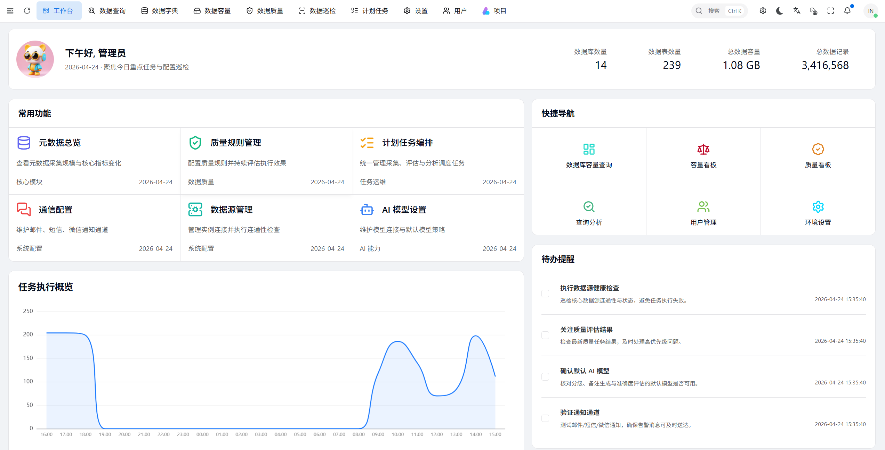
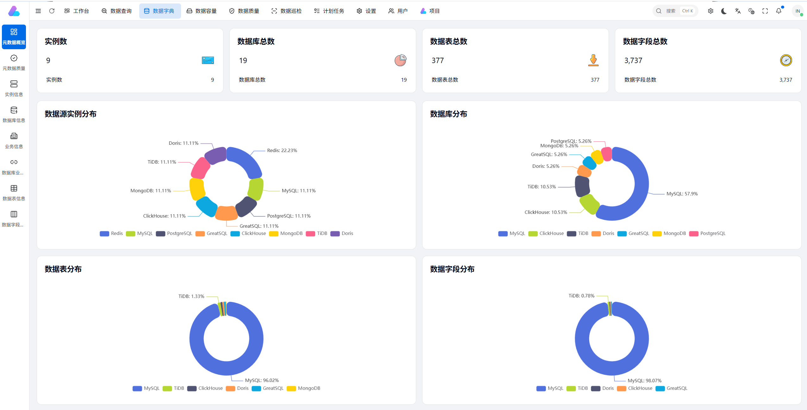
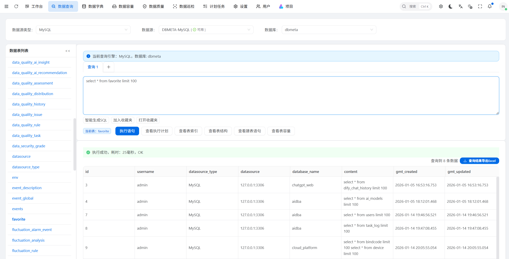
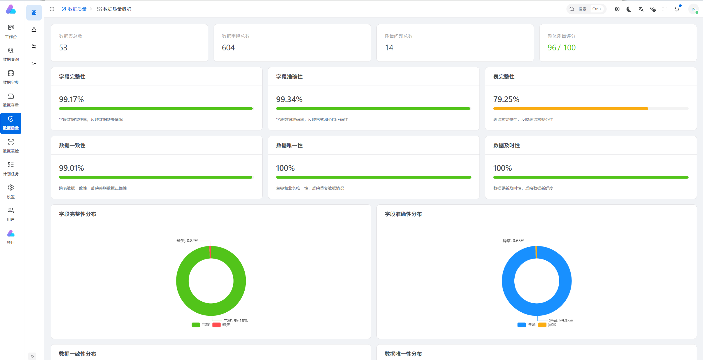
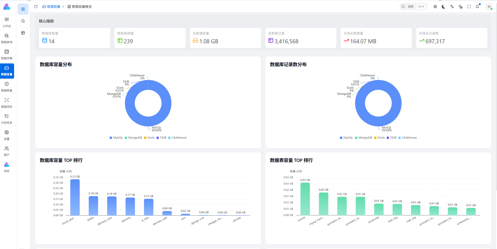
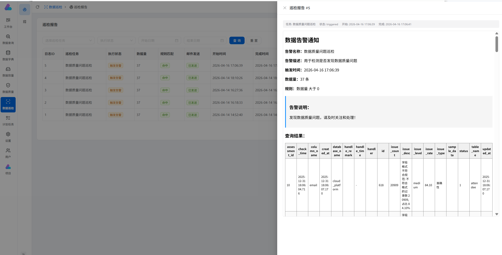

# DBMeta 界面快照（Snapshot）

本文档汇总 `docs/images` 目录下的界面截图，便于快速浏览产品页面效果。

## 1. 首页/总览

说明：展示系统首页或总览页面，用于快速了解核心指标与入口。

## 2. 元数据管理

说明：展示元数据相关页面（如实例、库表、字段等管理视图）。

## 3. 查询与分析

说明：展示数据查询或分析功能界面。

## 4. 数据质量

说明：展示质量规则、任务、问题或质量看板相关页面。

## 5. 容量与分析

说明：展示容量分析、趋势统计或排行榜等可视化页面。

## 6. 数据巡检与告警

说明：展示数据巡检，报告预览能力页面。
